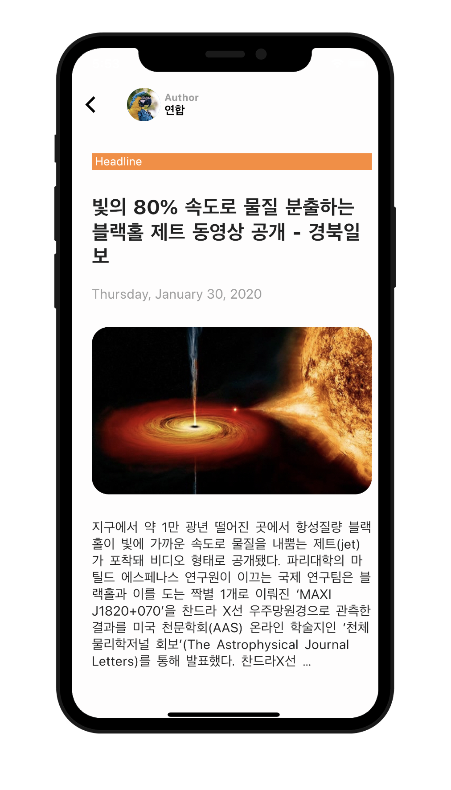
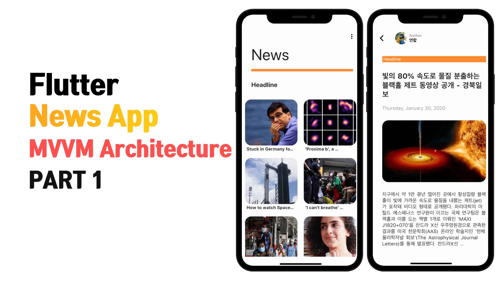
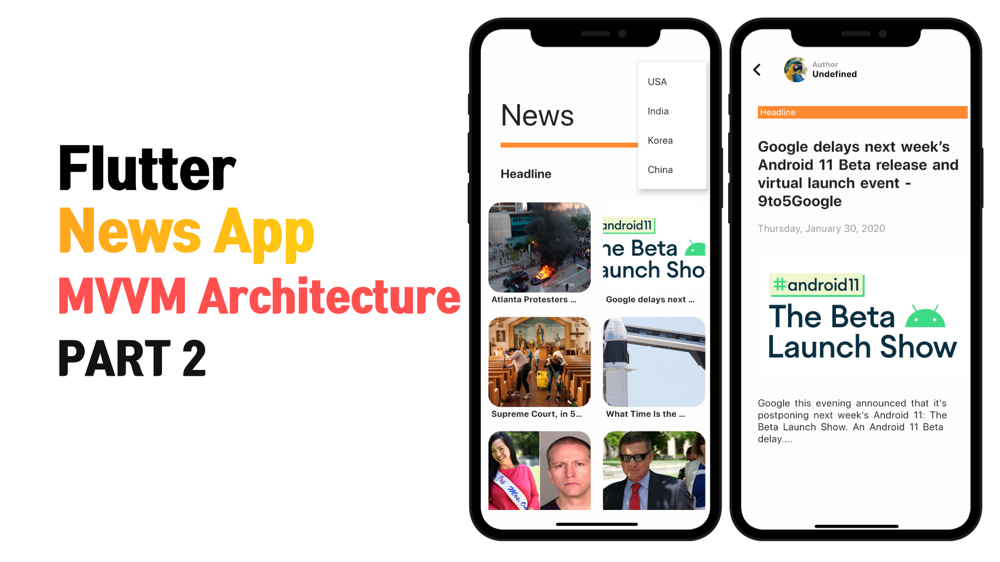

# Flutter News App (MVVM Study)
Flutter News App - MVVM Architecture Study
(Model, View, ViewModel)

   

### API
NewsAPI
* http://newsapi.org/

### Package
Dio : A powerful Http client for Dart
* https://pub.dev/packages/dio

Provider : A wrapper around InheritedWidget to make them easier to use and more reusable.
* https://pub.dev/packages/provider

Cached Network Image : A flutter library to show images from the internet and keep them in the cache directory.
* https://pub.dev/packages/cached_network_image

Intl : This package provides internationalization and localization facilities, including message translation, plurals and genders, date/number formatting and parsing, and bidirectional text.
* https://pub.dev/packages/intl

### Youtube

### Reference

Design
* https://bit.ly/2zC1AnP
